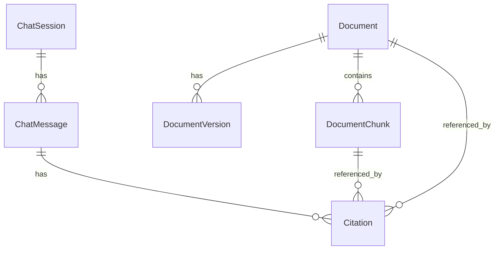

# Data Model

## PostgreSQL Entities

### Document
| Column | Type | Notes |
|--------|------|-------|
| id | UUID | PK |
| title | VARCHAR | Display name |
| filename | VARCHAR | Original filename |
| mime_type | VARCHAR | Content type |
| version | INT | Current version, starts at 1 |
| status | ENUM | pending, processing, indexed, failed, archived |
| created_at | TIMESTAMP | |
| updated_at | TIMESTAMP | |

### DocumentVersion
| Column | Type | Notes |
|--------|------|-------|
| id | UUID | PK |
| document_id | UUID | FK → Document |
| version | INT | |
| storage_path | VARCHAR | Path on filesystem |
| checksum | VARCHAR | SHA-256 |
| created_at | TIMESTAMP | |

### DocumentChunk
| Column | Type | Notes |
|--------|------|-------|
| id | UUID | PK — also Qdrant point ID |
| document_id | UUID | FK → Document |
| document_version | INT | |
| page | INT | Nullable |
| section | VARCHAR | Nullable |
| chunk_index | INT | Order within document |
| text | TEXT | Full chunk text (source of truth) |
| token_count | INT | Approximate |

### ChatSession
| Column | Type | Notes |
|--------|------|-------|
| id | UUID | PK |
| title | VARCHAR | Auto from first question |
| created_at | TIMESTAMP | |

### ChatMessage
| Column | Type | Notes |
|--------|------|-------|
| id | UUID | PK |
| session_id | UUID | FK → ChatSession |
| role | ENUM | user, assistant |
| content | TEXT | |
| created_at | TIMESTAMP | |

### Citation
| Column | Type | Notes |
|--------|------|-------|
| id | UUID | PK |
| message_id | UUID | FK → ChatMessage |
| document_id | UUID | FK → Document |
| chunk_id | UUID | FK → DocumentChunk |
| page | INT | Nullable |
| quote | TEXT | Excerpt from chunk |

## Qdrant Collection: knowledge_chunks

**NOT stored in Qdrant:** chat history, document text, user data.

| Field | Type | Purpose |
|-------|------|---------|
| id | UUID | Same as DocumentChunk.id |
| vector | float[768] | nomic-embed-text embedding |
| payload.chunk_id | string | Join to PG |
| payload.document_id | string | Join to PG |
| payload.page | int? | Citation display |
| payload.section | string? | Citation display |
| payload.chunk_index | int | Ordering |

## ER Diagram

